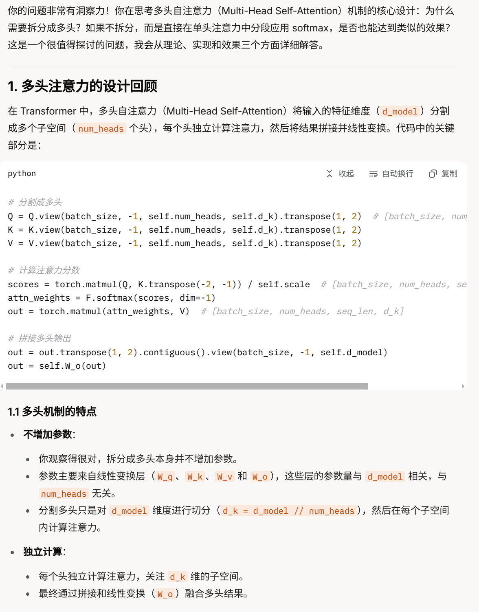
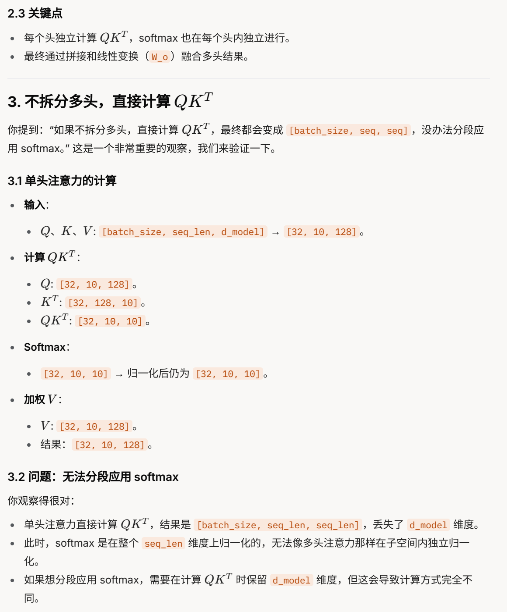
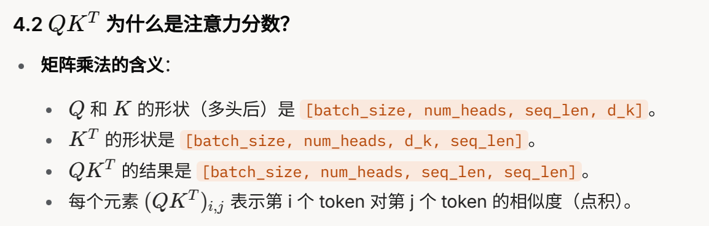

```python
from tkinter import NO
import torch
import torch.nn as nn 
import torch.nn.functional as F 
import math 

class MultiHeadAttention(nn.Module):
    def __init__(self, d_model, num_heads, dropout=0.1):
        """
        Args:
            d_model (int): 输入和输出的特征维度（如 512）
            num_heads (int): 注意力头的数量（如 8）
            dropout (float): Dropout 比率
        """
        super().__init__()
        assert d_model % num_heads == 0, "d_model must be divisible by num_heads"
        
        self.d_model = d_model # 模型维度
        # 为什么要将注意力分成多个头？这样做目的是什么？有什么优势？
        self.num_heads = num_heads # 注意力头数
        self.d_k = d_model // num_heads # 每个头的维度
        
        # Q, K, V 的线性变换层
        self.W_q = nn.Linear(d_model, d_model, bias=False)
        self.W_k = nn.Linear(d_model, d_model, bias=False)
        self.W_v = nn.Linear(d_model, d_model, bias=False)
        self.W_o = nn.Linear(d_model, d_model, bias=False) # 输出线性变换
        
        self.dropout = nn.Dropout(dropout)
        
        # 为什么要要乘上缩放因子，是为了 解决什问题？
        self.scale = math.sqrt(self.d_k) # 缩放因子
        
    # 这里的mask是怎么用的，是解码端用的对吗？怎么使用他
    def forward(self, query, key, value, mask=None):
        """
        Args:
            query， key， value(Tensor):输入张量，形状[batch_size, seq_len, d_model]
            mask(Tensor, optional):注意力掩码，形状[batch_size, seq_len, seq_len]
            
        Returns:
            Tensor:输出张量，形状[batch_size, seq_len, d_model]
        """
        batch_size = query.size(0)
        
        # 线性变换成Q，K，V
        Q = self.W_q(query) # [batch_size, seq_len, d_model]
        K = self.W_k(key)
        V = self.W_v(value)
        
        # 分割成多头
        Q = Q.view(batch_size, -1, self.num_heads, self.d_k).transpose(1,2)  # [batch_size, num_heads, seq_len, d_k]
        K = K.view(batch_size, -1, self.num_heads, self.d_k).transpose(1,2)
        V = V.view(batch_size, -1, self.num_heads, self.d_k).transpose(1,2)
        
        # 计算注意力分数
        # 这里我表示非常的不懂，为什么QK^T就是注意力分数了？
        # 他的思想是什么呢？一个输入，拆分成查询query，关键字key， 值value？
        # 是怎么样一个思想，表达了每个得分呢？表示很迷
        # 这里除以self.scale是避免单个值过大，造成的不稳定吗，除以scale以后，再经过softmax就不存在这个问题，对吗？
        scores = torch.matmul(Q, K.transpose(-2, -1)) / self.scale # [batch_size, num_heads, seq_len, seq_len]
        # 所谓注意力得分，我是不是可以这么理解：这里的scores是多头的得分，即把d_model维度拆分成多个头。就是第一个头关注0-d_k维的得分，第二个头关注d_k-2*d_k得分，依此类推
        # 那Q，K的矩阵乘积结果，第一行是否可以看做计算第一个字时，整个序列所有字的注意力得分（d_model分段成d_k段落的得分）。
        # 那Q，K的矩阵乘积结果，第二行是否可以看做计算第二个字时，整个序列所有字的注意力得分（d_model分段成d_k段落的得分）。
        # 那Q，K的矩阵乘积结果，第一行是否可以看做计算第三个字时，整个序列所有字的注意力得分（d_model分段成d_k段落的得分）。
        # 依次类推...
        # 当我们对QK^T / scale的结果做softmax后，整体注意力为1，注意力高的，softmax结果大一些，关注度高一些.
        # 当我们在拿到softmax(QK^T/scale)的值后，就拿到注意力得分字典。我们传进来一个字就能计算出注意力值是多少。softmax(QK^T/scale) @ V, 
        # 其中softmax(QK^T/scale)第一行（以最后2个维度视角看的第一行）就表示第一个字的注意力权重表（相对于所有字），依此第二行就是第二个字的注意力权重表（相对于所有字）...
        # 我的理解对吗？
        
        # 应用掩码（可选）
        # 这部分不懂，需要你再详细讲解下，这个是解码端用到对不对？
        # 请结合解码端的思路和我详细讲解下
        if mask is not None:
            scores = scores.masked_fill(mask==0, -1e9)

                
        # 归一化并加权求和
        attn_weights = F.softmax(scores, dim=-1)
        attn_weights = self.dropout(attn_weights)
        out = torch.matmul(attn_weights, V) # [batch_size, num_heads, seq_len, d_k]
        
        # 拼接多头输出并线性变换
        # 这里的意思是计算好每个字的d_k维度的权重注意力值后再合并成d_model维度的权重注意力值对吗？
        out = out.transpose(1, 2).contiguous().view(batch_size, -1, self.d_model)
        out = self.W_o(out)
        return out
```

## **我的疑问都写在了代码里，请详细回答我:**


## **我发现拆分成多头后，没有增加参数之类的。只是在计算QK^T之后，使用softmax。我在想，那我们不要这么拆分行不行，我就分段应用softmax是不是也ok**




## **这个应该可以验证，应该是一样的吧？多头注意力思想，是关注不同维度下的不同语义不同表达，避免全局softmax削弱了一些语义的表达。如果不采用多头，就一个头的话，全局softmax。如果1000个维度，那么平均每个维度只能拿0.001分。如果我拆分成10个头，每个维度平均能拿0.01分。这就相当于放大了权重。我们再看多头的计算。假设128维度。拆分8头，每头16维度。如果我们直接不拆分计算，我们在QK.T之前。。。好像行不通。因为最终都会变成[batch_size, seq, seq] 等于模型维度不拆分就全部计算在里面了。没办法分段应用softmax了。只能先拆成多头，才能在QK^T之后使用softmax。再合并结果，确实，这样才能关注分段语义信息。**





## **关于这里你的回答，我再思考下。Q是query，我拿着搜索词Q，去和每个关键词K计算相似度。得到该搜索词Q与所有词在d_k中每个维度总得分（d_k维度被消除，仅保留查询词和关键词的得分）。我再将得到的结果进行softmax，就得到每个查询词的注意力权重表。其中第一行是第一个词的注意力权重。我们再拿着Value表来计算在d_k维度下，每个维度与所有关键词的得分之和。最终就计算出，每个词在d_k维度中每个维度得分。最后reshap回d_model。这里的q相当于词的查询索引。k相当于词的关键语义。v相当于词的值计算，计算出的值，我们拿着计算好的值，再去vocab中寻找相似度最高的值，相似度最高的值，即为v最终映射的值，对吗**




## **按你这么来讲的话，其实v就相当于数据库了。q是我们的查询词。即和输入相关性很高。我们希望匹配上一些有用的关键词key。然后拿着匹配好的关键词去v中提取有价值的信息。**


