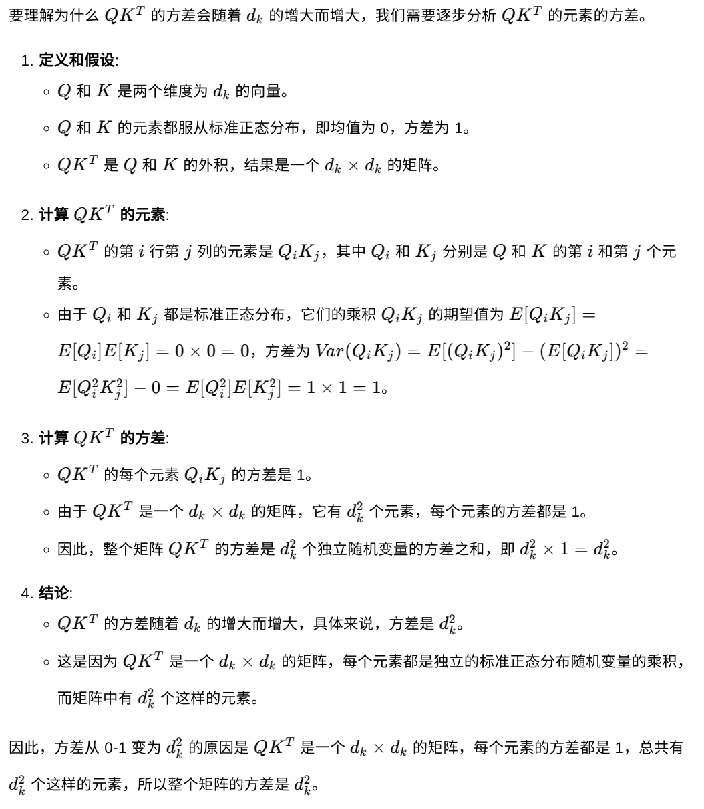
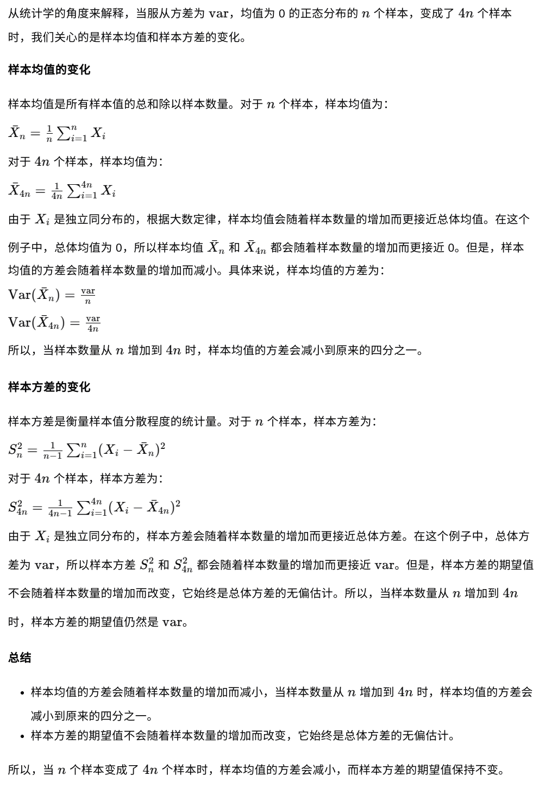
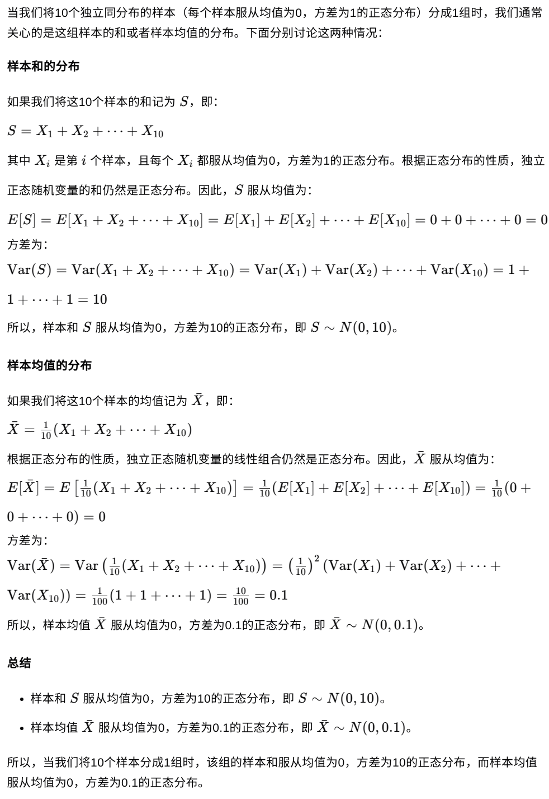
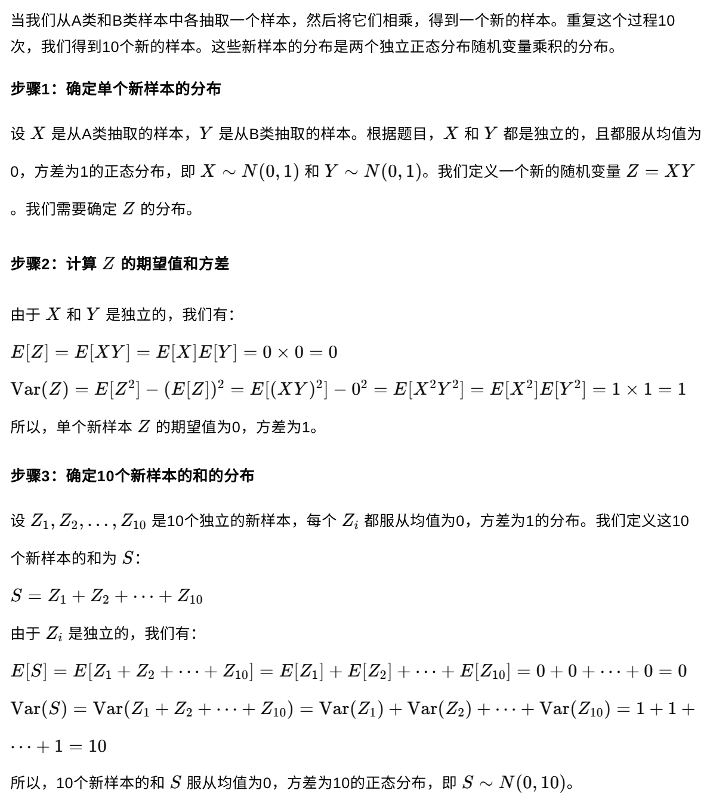
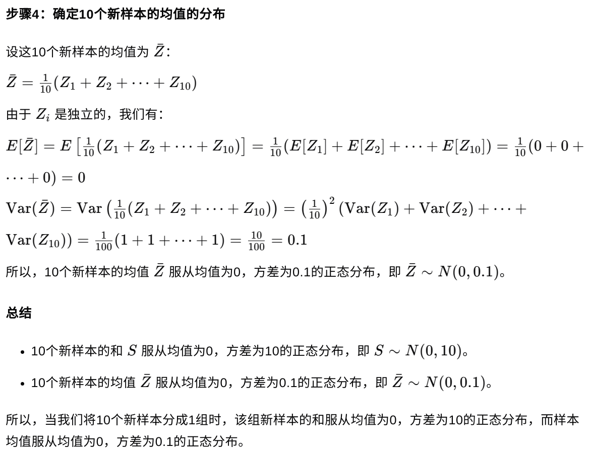
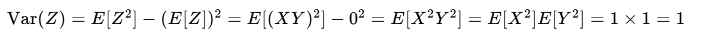
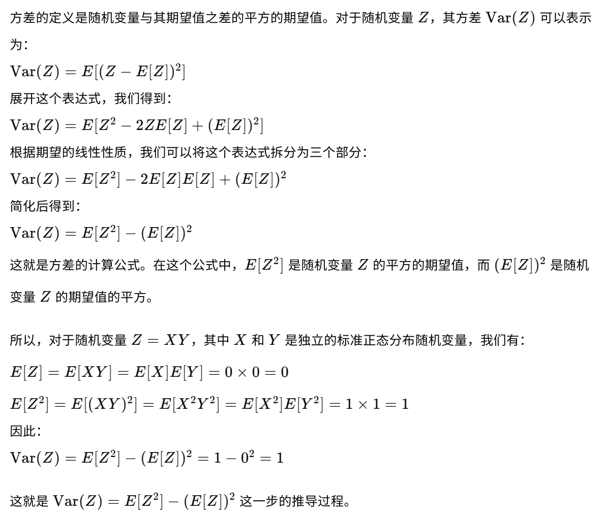

## QK.T的过程，其实就是将原来d_k中的每个元素相乘并以d_k为组，结合成一个新元素了：

**因为：**
Q的shape是：seq_len, d_k,
K的shape是：seq_len, d_k,
QK.T的shape是：seq_len, seq_len
这个过程就相当于：QK.T的每个元素是由Q中某行的d_k个元素和K中某行的d_k个元素点积获得的结果。
我们假定Q和K中的seq_len*d_k个元素，服从均值为0，方差为1的正态分布。
那么Q中元素q和K中元素k相乘的结果即（q*k）也是服从均值为0，方差1分布，可以看后面的推理证明。把这个结果看成是z的话。
1个z是服从均值0方差1正态分布，d_k个z相加呢？他就服从均值0，方差为d_k平方的正态分布，后面有类似证明。

## **还是没明白，从统计学角度来解释。当服从方差为var，均值为0正态分布的n个样本，变成了4n个样本。那他的均值和方差是怎么变的**

## **当单个样本是服从均值0，方差1分布，当我们将10个样本分成1组。该组的样本服从什么样的分布呢**

`注意看下样本和的分布，因为样本和就对应我们QK.T的过程`

**当A，B两类样本是服从均值0，方差1的独立分布，当我们从A抽取1个样本，B抽取一个样本，让他们相乘组合成新的样本。我们如此动作执行10次。将10个新样本分成1组。该组新样本服从什么样的分布呢**

## **这一步是怎么推导的**

