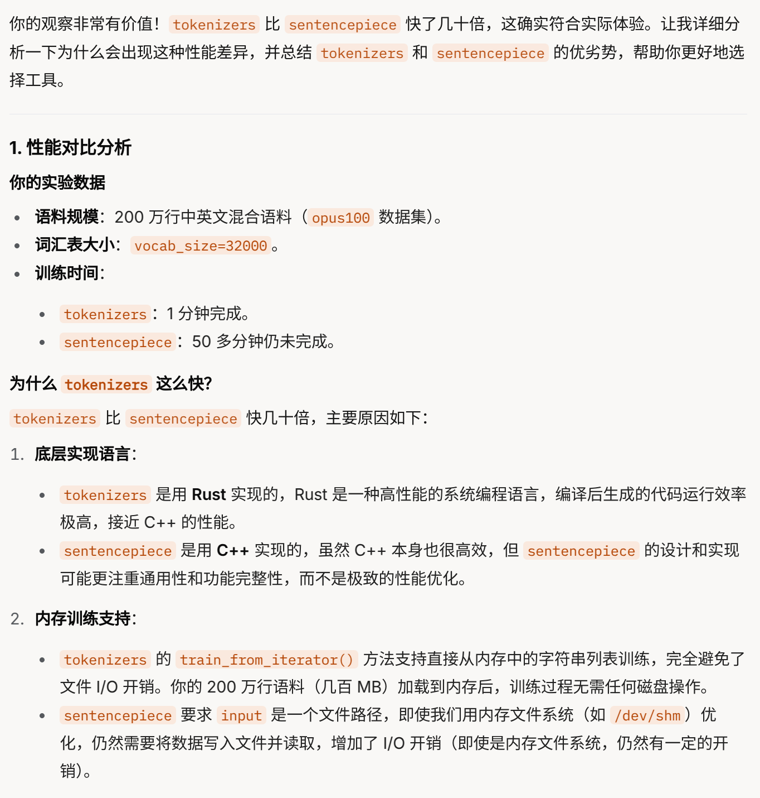
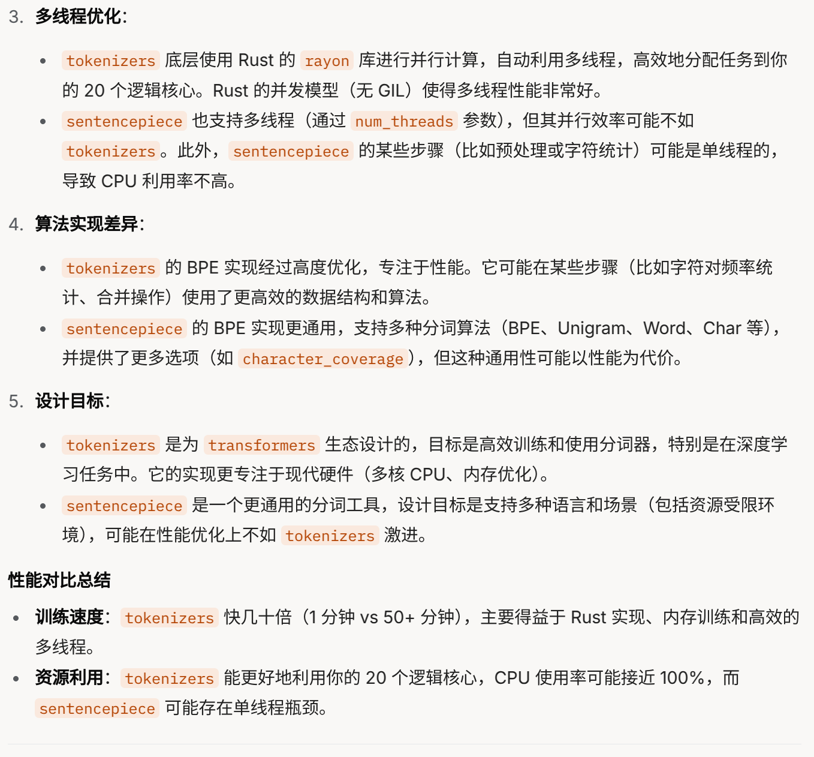
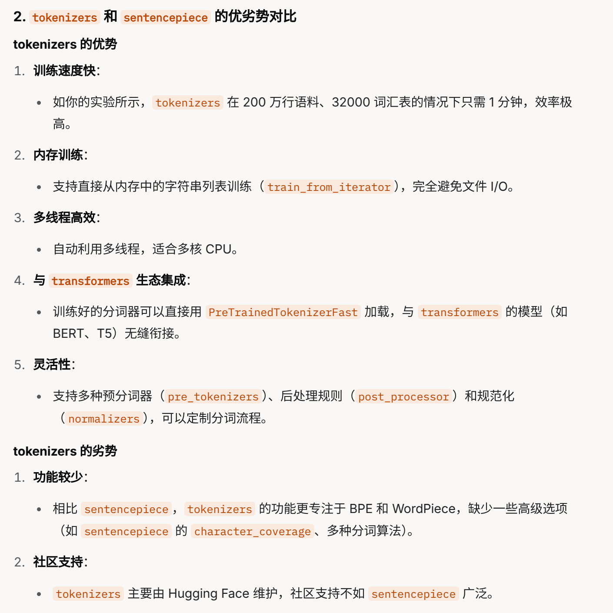
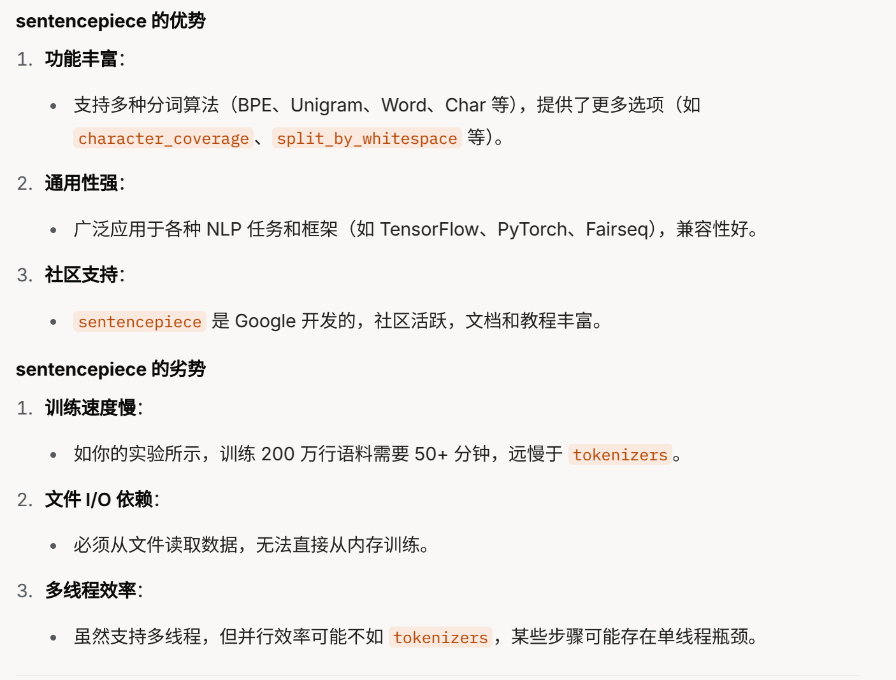
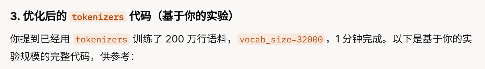
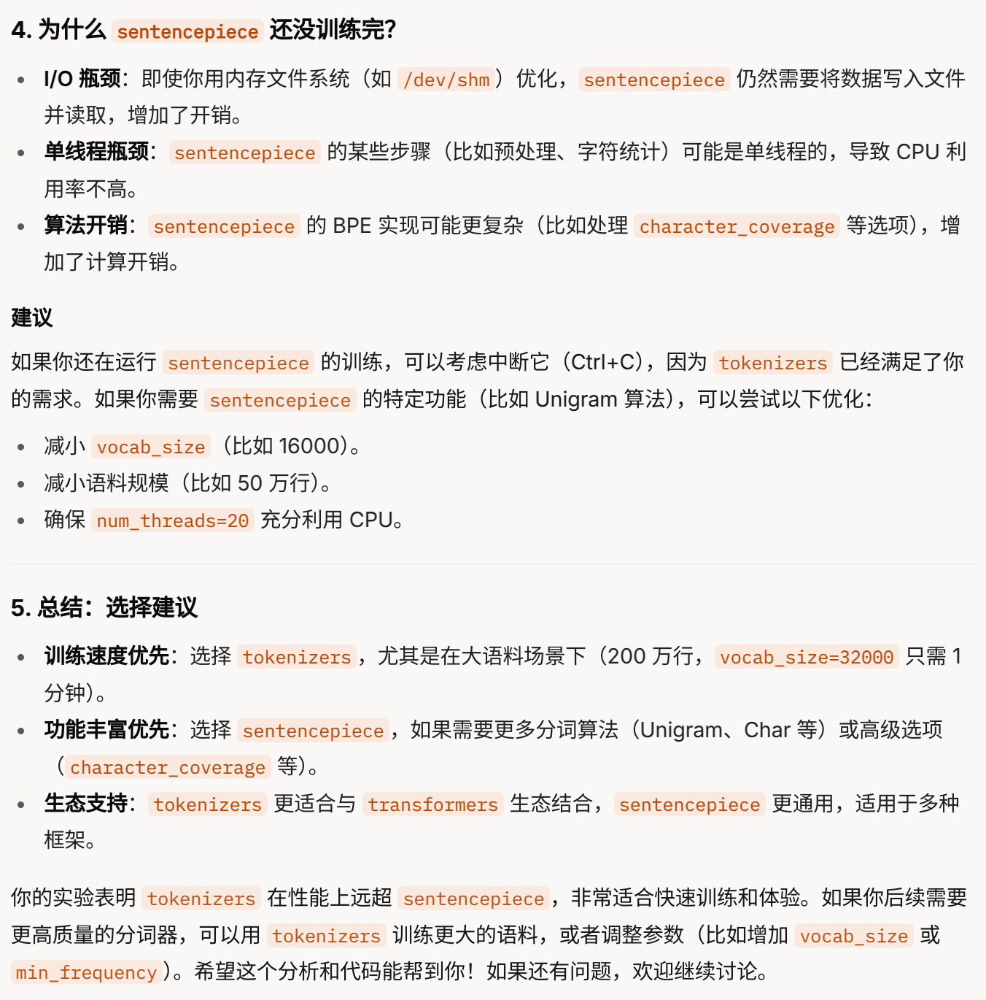

## tokenizers比sentencepiece快了几十倍啊。我训练200万行中英文的语料，32000的Vocab。一分钟就训练完成了。50多分钟过去了。sentencepiece到现在还没训练结束












```python
from tokenizers import Tokenizer, models, trainers, pre_tokenizers
import time

# 1. 加载语料到内存
def load_corpus_to_memory(file_path):
    start_time = time.time()
    with open(file_path, "r", encoding="utf-8") as f:
        lines = f.readlines()
    print(f"已加载 {len(lines)} 行到内存，耗时 {time.time() - start_time:.2f} 秒")
    return lines

# 2. 训练 BPE 分词器（完全在内存中）
def train_bpe_tokenizer(corpus, vocab_size=32000, special_tokens=["[PAD]", "[UNK]", "[CLS]", "[SEP]", "[MASK]"]):
    start_time = time.time()
    
    # 初始化一个 BPE 分词器
    tokenizer = Tokenizer(models.BPE())
    
    # 设置预分词器（按空格和标点分词）
    tokenizer.pre_tokenizer = pre_tokenizers.Whitespace()
    
    # 定义 BPE 训练器
    trainer = trainers.BpeTrainer(
        vocab_size=vocab_size,
        special_tokens=special_tokens,
        min_frequency=2,
        show_progress=True
    )
    
    # 直接在内存中训练
    tokenizer.train_from_iterator(corpus, trainer)
    
    print(f"BPE 分词器训练完成，耗时 {time.time() - start_time:.2f} 秒")
    return tokenizer

# 3. 保存分词器
def save_tokenizer(tokenizer, path="my_tokenizer"):
    tokenizer.save(path)
    print(f"分词器已保存到 {path}")

# 4. 分词测试
def tokenize_text(tokenizer, text):
    encoded = tokenizer.encode(text)
    return encoded.tokens

# 5. 主函数
def main():
    # 加载语料到内存
    corpus = load_corpus_to_memory("corpus.txt")
    
    # 使用 200 万行
    corpus = corpus[:2000000]
    print(f"使用 {len(corpus)} 行进行训练")
    
    # 训练 BPE 分词器
    tokenizer = train_bpe_tokenizer(corpus, vocab_size=32000)
    
    # 保存分词器
    save_tokenizer(tokenizer, "my_tokenizer.json")
    
    # 测试分词效果
    text = "Hello, world! 你好，世界！"
    tokens = tokenize_text(tokenizer, text)
    print("\n分词结果：")
    print(f"混合文本: {tokens}")

if __name__ == "__main__":
    main()
```

